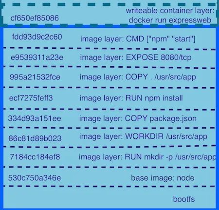

# Docker Kubernetes

## What is an image? 
*A packaged application or snapshot which container all of the necessary dependencies needed to run*

- Images are built with layers which corresponds with the dockerfile it's building the container from

### Example of image layers


*a SHA Hash is used to identify all layers that were combined*

## Image vs Container

> Image = application code to run or all necessary binaries/libraries
 
> Container = Instance of image, multiple containers running the same image

## Container Lifetime & Persistant Data
#### Volumes & Bind Mounts:
* Volumes are located outside of the container (typically on the host machine)
  * this is native to docker and can be shared with other containers since it's persisted on the host
    * Ex) Running your container on a windows machine would allow any container to be removed but any new running container with the same image can still access the same volume setup previously
* Bind Mounts share files with the container from the host
  * this also maps host files/directories to the containers files/directories 
    * In the event the container or pod is killed the persisted data will be lost with the container and not accessisble by other containers. 
## Docker Commands and their explainations
---
*This commands does the following*
```
docker container run -p 80:80 nginx
```
>1. Pull the latest nginx image (by default docker will always pull the latest image unless specified for a specific version)
>2. Create the continer with all of the necessary nginx dependencies
>3. Open port 80 on the host IP (my localhost)

> `-p` is short for publish which forwards the port from the host machine to the container **[Host Port:Container Port]**

<br>

*Tells us the history of the images*
```
docker image inspect [IMAGE]
```


